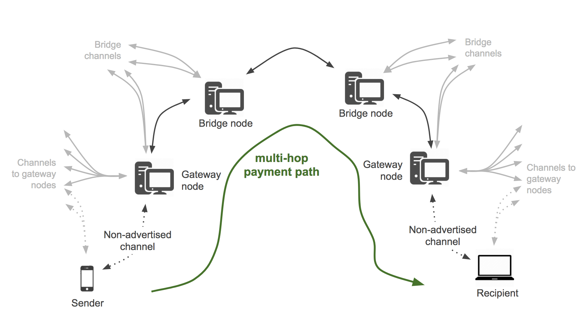

# Payment Routing

## Overview

**Payment routing** is a fundamental concept in Lightning transactions, enabling nodes that do not have explicit channels to transmit payments to one another.  

We expect most Lightning users to be sending and receiving transactions using mobile devices or computers that have intermittent power and intermittent access to the internet. Because of this, the vast majority of channels will be opened between end user nodes and routing nodes. A routing node is a Lightning node operated with the intent to be online at all times, earning fees by routing Lightning payments. A routing node, like any other Lightning node, must be able to interface with the Bitcoin network. Routing nodes don’t necessarily need to be full nodes and can operate using light client protocols such as [neutrino](https://github.com/lightninglabs/neutrino). However, more heavily-capitalized routing nodes will likely prefer the additional security provided by a fully-validating Bitcoin node.

“Gateway” routing nodes are those that directly serve end users. These nodes will serve a relatively small number of users \(likely in the hundreds\) and will have modest hardware, bandwidth and capital requirements. Over time, some gateway nodes will become more highly connected \(see bridge channels below\). We’re currently working on tools and guides for routing node operators, and initial versions of those will be released over the coming months. Our goal is to help facilitate the development of a broadly distributed routing node ecosystem with low barriers to entry. 

as mentioned above, Carol connects to the Lightning Network through a set of routing nodes \(by default, Autopilot will create channels with five nodes\). A routing node is a computer intended to be online at all times, and that facilitates the sending of payments for other users. Bloomingblocks is also connected to the network via its own set of routing nodes. Through a process that’s analogous to finding connections between people in “Six Degrees of Separation,” Carol’s Lightning App automatically determines which nodes link her with Bloomingblocks, and Carol’s transaction is sent across that series of links. The next post in this series will provide more information about routing nodes, channel balance and the routing network.\]  


## Details

### Routing Hints

Routing hints provide information to find non-advertised, or private, channels. This allows routing of payments to nodes that are not publicly visible on the network. A routing hint provides a partial route between the receiver's private node and a public node. This routing hint is then included in the invoice generated by the receiver and provided to the payer.

Routing hints require the sharing of a 'node\_id' and 'channel\_id', where the 'node\_id' represents the public node and the 'channel\_id' represents the private channel. The 'channel\_id' is meaningless to the payer of the invoice but is recognizable to the public node, as it is privately connected to the node that generated the invoice. By specifying numerous routing hints in an invoice, users can increase the likelihood that a paying node can find a successful path to the receiver.

Users can view route hints using `lncli decodepayreq <invoice>.` 

```text
    "route_hints": [                                           
        {
            "hop_hints": [
                {
                    "node_id": "03236a685d30096b26692dce0cf0fa7c8528bdf61dbf5363a3ef6d5c92733a3016",
                    "chan_id": "1589513382741409793",
                    "fee_base_msat": 1000,
                    "fee_proportional_millionths": 1,
                    "cltv_expiry_delta": 144
                }
            ]
        }
    ]
```

### Multi-hop Payment Path




### 

## Resources

### Key People

* [Person 1](payment-routing.md)
* [Person 2](payment-routing.md)

### See also

## References

