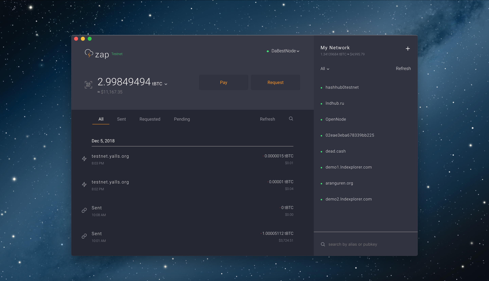

# Zap Desktop

## Overview

**Zap Desktop** is an open source desktop Lightning Network [wallet](./) for Windows, Linux, and macOS developed by Jack Mallers. First released on January 26, 2018, the project has since been under development and remains in beta. As of January 14, 2018, the project has 39 contributors on GitHub, and is on version 0.3.3-beta.

## Details

### Functionality

Zap Desktop implements a fully functional `lnd` node in the desktop client. Zap supports Bitcoin `testnet3` in the default operating mode, but can also connect to `lnd` configured for any network. 

Zap supports autopilot configuration, remote node connection, BTCPay support, and Bitcoin unit conversions.

### User Experience

Zap walks users through the creation of a wallet and Lightning-compatible node. 

### Tech Stack

Zap is built with Electron, React, and Redux on top of the [`lnd`](../lnd/) implementation of the Lightning Network.

## Resources

[Project Homepage](https://zap.jackmallers.com/)

[GitHub Repository](https://github.com/LN-Zap/zap-desktop)

[Slack Community](https://join.slack.com/t/zaphq/shared_invite/enQtMzgyNDA2NDI2Nzg0LTQwZWQ2ZWEzOWFhMjRiNWZkZWMwYTA4MzA5NzhjMDNhNTM5YzliNDA4MmZkZWZkZTFmODM4ODJkYzU3YmI3ZmI)

### Key People

* [Jack Mallers](https://twitter.com/JackMallers)

### See also

[Getting started with Zap Desktop](https://ln-zap.github.io/zap-tutorials/zap-desktop-getting-started)

[Connect your BTCPay Server to Zap Desktop](https://ln-zap.github.io/zap-tutorials/zap-desktop-btcpay-server)

## References

\[1\] [https://zap.jackmallers.com/](https://zap.jackmallers.com/)

\[2\] [https://github.com/LN-Zap/zap-desktop](https://github.com/LN-Zap/zap-desktop)

