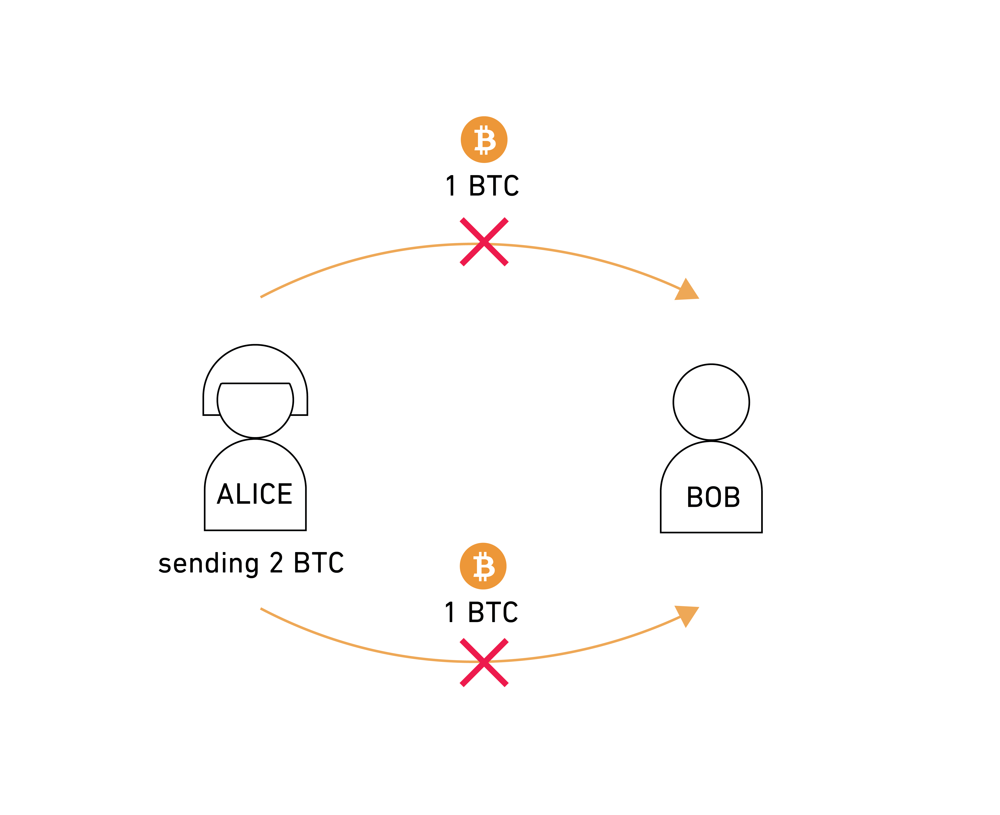
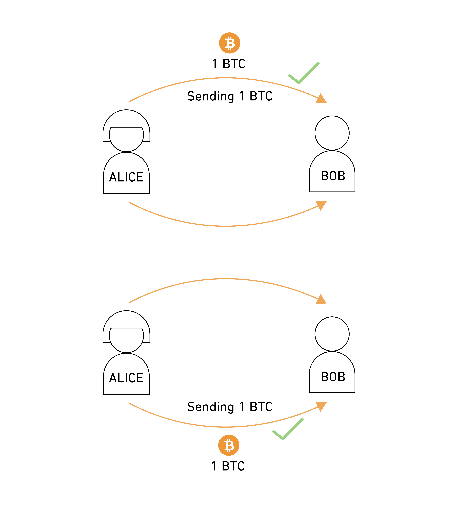
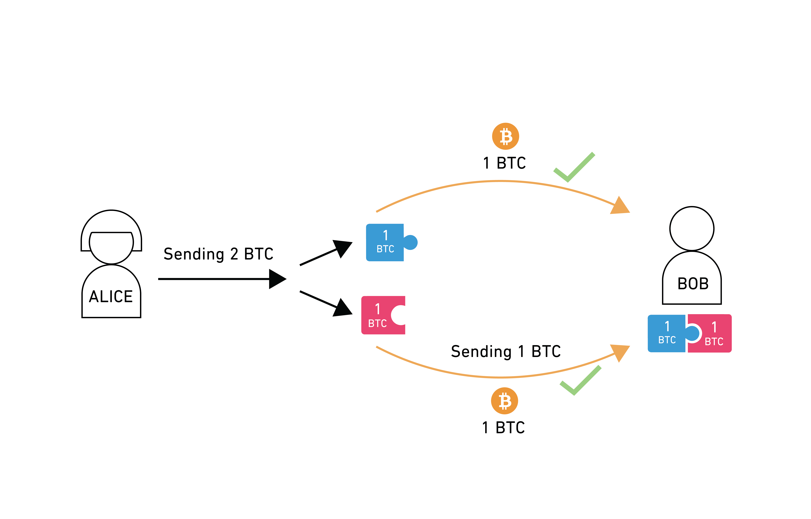
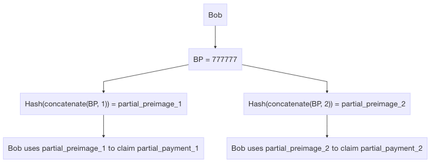
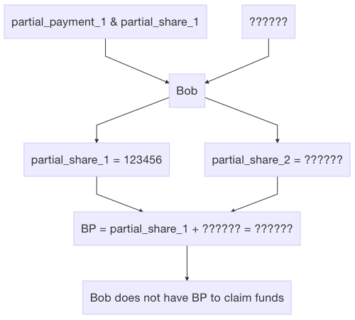

# Atomic Multi-Path Payments

## Details

### Problem

* Alice has two channels with Bob
  * channel 1: 1 BTC
  * channel 2: 1 BTC
* Alice wants to send 2 BTC to Bob
* Bob sends a 2 BTC invoice to Alice
* Alice cannot pay the invoice because each channel only has 1 BTC

### Solution 1: Naive Way

* Alice wants to send 2 BTC to Bob
* Step 1
  * Bob sends a 1 BTC invoice to Alice
  * Alice pays 1 BTC to Bob through channel 1
* Step 2
  * Bob sends a 1 BTC invoice to Alice
  * Alice pays 1 BTC to Bob through channel 2

### Solution 2: Atomic Multi-Path Payment

* Alice opens a channel with Bob. 
* Bob sends 2 BTC invoice to Alice
* Alice pays 2 BTC to Bob by splitting the payment
  * 1 BTC goes through channel1
  * 1 BTC goes through channel2
* Bob receives and combines the two payments to claim his BTC 

### Atomic Multi-Path Payment Goals

* Atomicity: Bob cannot receive the full payment until he receives all of the partial payments
* Avoid Payment Hash Reuse: Each partial payment has a distinct payment hash
* Order Invariance: Partial payment order does not matter
* Non-interactive Setup: Bob does not have to know the transaction is an AMP

## How It Works

Alice generates two partial shares since she'll pay through two channels. In this example, we'll use two random numbers 123456 and 654321.

Alice generates a base pre-image \(BP\) by adding the partial shares. 123456 + 654321 = 777777. If Bob knows BP, then he can claim the funds.

Alice computes the partial pre-images by concatenating the base pre-image to the sequence number i, then hashing the result.

Alice creates the payment payments by hashing the partial pre-image. This makes each pre-image distinct and indistinguishable from the others.

Alice sends the partial payments and partial shares to Bob.

When Bob receives all of the payments, he will then combine partial shares to generate the base pre-image.

Bob can now use the base pre-image to generate the partial pre-images to claim funds.

If Bob does not receive **all** of the partial payments, then he cannot generate the base pre-image thus making it atomic.

### References

\[1\] [https://lists.linuxfoundation.org/pipermail/lightning-dev/2018-February/000993.html](https://lists.linuxfoundation.org/pipermail/lightning-dev/2018-February/000993.html)

